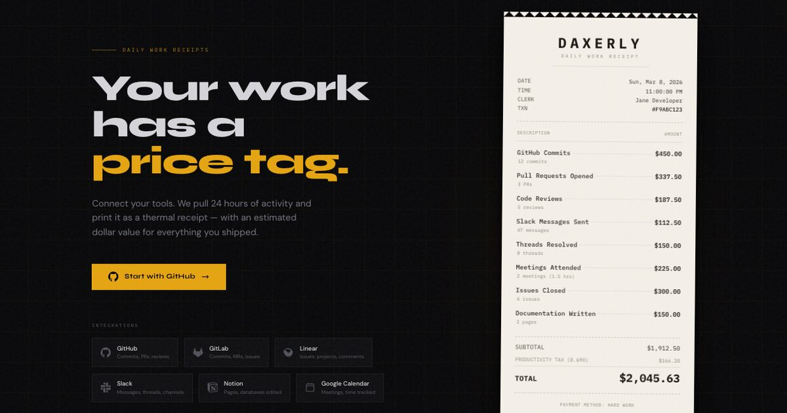

<div align="center">


# Daxerly

### Your work has a price tag.

Connect GitHub and Daxerly prints your last 24 hours of work as a thermal
receipt — with an estimated dollar value for everything you shipped.

<br/>

[](https://daxerly.apoorvdarshan.com)
&nbsp;
[](https://daxerly.apoorvdarshan.com)

[](https://nextjs.org)
[](https://www.typescriptlang.org)
[](https://tailwindcss.com)
[](https://www.prisma.io)
[](https://neon.tech)
[](https://next-auth.js.org)

<br/>



</div>

---

**Daxerly** turns your daily activity into proof of work — formatted as a receipt.
Sign in, connect **GitHub**, and generate a daily *work receipt* that lists what
you shipped in the last 24 hours, with an estimated dollar value, a productivity
tax, and a grand total. Download it, copy it as an image, or share a link. It's
completely **free**.

## ✨ Features

- **One-click work receipts** — pulls your last 24h of activity and prices it out
- **GitHub-powered** — commits, pull requests, code reviews, and issues
- **Thermal-receipt UI** — a pixel-crafted receipt you can download or copy as PNG
- **Shareable** — every receipt gets its own page and social (OG) image
- **Receipt history** — revisit everything you've generated
- **Free & no lock-in** — sign in with GitHub and go

## 🧾 How it works

1. **Sign in** with GitHub (NextAuth with database-backed sessions).
2. **Connect** — GitHub via OAuth; your access token is stored per user.
3. **Generate** — Daxerly pulls the last 24 hours of activity from GitHub.
4. **Pricing** — each activity type maps to an estimated time-per-unit, valued at
   **$150/hr**, plus an **8.69% "productivity tax."**
5. **Receipt** — the line items render as a thermal receipt you can save or share.

> Valuations are a playful heuristic, not an invoice. 😄

## 🔌 Integrations

| Tool | What it reads |
| --- | --- |
| **GitHub** | Commits, pull requests opened, code reviews, issues |

## 🛠 Tech Stack

- **Framework:** Next.js 14 (App Router) · React 18 · TypeScript
- **Styling:** Tailwind CSS
- **Auth:** NextAuth.js v4 (GitHub) with the Prisma adapter and database sessions
- **Database:** PostgreSQL on [Neon](https://neon.tech), via Prisma 5
- **Image export:** html-to-image (receipts → PNG)
- **Hosting:** Vercel

## 🚀 Getting Started

### Prerequisites

- Node.js 20+
- A PostgreSQL database (a free [Neon](https://neon.tech) project works great)
- A GitHub OAuth app

### 1. Clone & install

```bash
git clone https://github.com/apoorvdarshan/daxerly.git
cd daxerly
npm install
```

### 2. Configure environment

```bash
cp .env.example .env
```

| Variable | Description |
| --- | --- |
| `DATABASE_URL` | PostgreSQL connection string (Neon) |
| `NEXTAUTH_SECRET` | Random secret — generate with `openssl rand -base64 32` |
| `NEXTAUTH_URL` | App URL — `http://localhost:3000` for local dev |
| `GITHUB_CLIENT_ID` / `GITHUB_CLIENT_SECRET` | GitHub OAuth app |

Register this GitHub OAuth **callback URL** (local dev):

```
http://localhost:3000/api/auth/callback/github
```

### 3. Set up the database

```bash
npx prisma migrate deploy   # apply migrations
npx prisma generate         # generate the Prisma client
```

### 4. Run

```bash
npm run dev
```

Open <http://localhost:3000>.

## 📁 Project Structure

```
src/
├─ app/
│  ├─ api/             # auth, connections, generate, receipts, og image
│  ├─ dashboard/       # connect GitHub + generate receipts
│  ├─ receipt/[id]/    # shareable receipt page
│  ├─ privacy · tos/   # legal pages
│  └─ page.tsx         # landing
├─ components/
│  └─ Receipt.tsx      # the thermal-receipt component
└─ lib/
   ├─ integrations/    # github activity puller
   ├─ summarizer.ts    # activity → dollar-value estimator
   └─ auth.ts          # NextAuth configuration
prisma/
└─ schema.prisma       # User · Account · Session · Connection · Receipt
```

## ☁️ Deployment

Runs on **Vercel** with a **Neon** Postgres database. Set the same env vars in
your Vercel project, point production `NEXTAUTH_URL` and your GitHub OAuth
callback URL at your domain (e.g. `https://your-domain/api/auth/callback/github`),
and run `prisma migrate deploy` on release.

## 📄 License

© 2026 Apoorv Darshan. All rights reserved.

<div align="center">
<br/>
<sub>Proof of work, formatted as a receipt.</sub>
</div>
